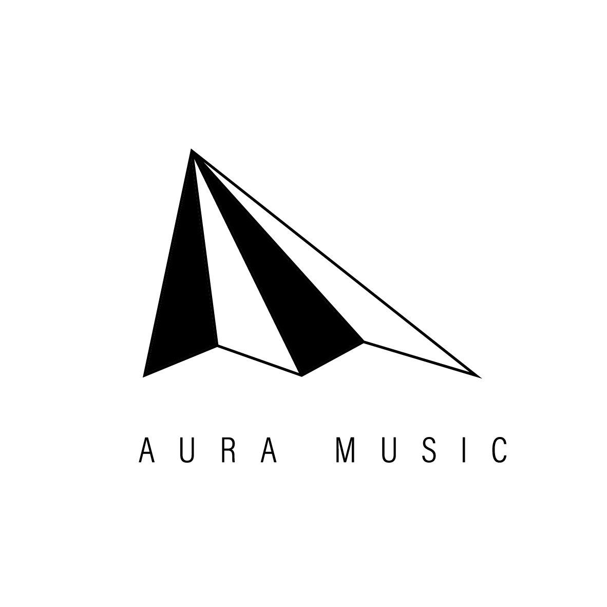

# Aura Music Agent 🎨🎼

An automated operations and social media partner built for **Aura Music** on top of the Hermes Agent framework. 

This repository houses the specialized agent persona, memory layers, and custom skill configurations used to automate social media curation, trend analysis, and workflow orchestration for our emerging charity.

<p align="left">
  
 
> **Aura Music in one sentence:** A charity that lets your curiosity explore the world through music. 🎹✨ [Visit our website](https://auramusic.asia/)
> 


---

## 💭 Project Vision & Core Goal

As an emerging charity, we spark with incredible ideas but are heavily stretched by our daily operations. The **Aura Music Agent** was created to act as an autonomous operations partner, handling background logistics so our human team can focus on scaling the charity's core mission.

By pairing **Hermes Agent** with external automations, this system creates a seamless bridge between instant messaging and multi-step organizational workflows.

### Key Features
* **Bilingual Storyteller:** Employs a natural Cantonese/English code-switching style tailored for authentic storytelling, paired with trendy, modern social media captions for public engagement.
* **Direct Messenger Integration:** Sits inside our team's Telegram group. Anyone on the team (or the boss!) can throw an unfiltered idea or inspiration directly to the agent to spin up a draft.
* **Hybrid Automation Architecture:** When local cloud infrastructure hits limitations (like search engine IP blocks), the agent seamlessly hands off data fetching to a self-hosted **n8n workflow**, pulling back a daily social monitor summary automatically.
* **Sovereign Infrastructure:** Containerized and deployed via Docker on Hostinger, ensuring total privacy for our charity assets and unreleased campaign materials.

---

## 🛠️ Tech Stack & Implementation

* **Core Engine:** Hermes Framework (Perception-Reasoning-Action loop)
* **Hosting Environment:** Hostinger (Docker & Docker-Compose)
* **Orchestration Layer:** n8n (Automated social monitoring and web queries)
* **Memory & Skills System:** Powered by file-based `SKILL.md` architecture. Our primary operational blueprint lives inside the `aura-music-social-agent` skill, tracking operational knowledge and tone criteria without relying on fragile runtime prompt strings.

---

## 🚀 Quick Start (For Our Team)

### Prerequisites
Ensure your `.env` file is fully populated with your `TELEGRAM_BOT_TOKEN`, `HOSTINGER_DEPLOY_KEY`, and `N8N_WEBHOOK_URL`. 

### Running Locally with Docker
To spin up the Aura Music Agent environment along with its integrated WebUI:

```bash
# Clone the repository
git clone [https://github.com/lyhui/aura-music-agent.git](https://github.com/lyhui/aura-music-agent.git)
cd aura-music-agent

# Spin up the containers
docker-compose up -d
```

### Initializing the Skill
Once inside the agent terminal or interacting via Telegram, load the specialized charity configuration:

```bash
/personality aura-music-social-agent
```

---
## 🗺️ Roadmap
- WhatsApp Integration: Auto-confirmation pipelines for our workshop and event registrations.
- Direct Publishing: Enabling the agent to safely publish approved drafts from Telegram straight to our social channels.


---

<p align="center">
  
</p>

# Hermes Agent ☤

<p align="center">
  <a href="https://hermes-agent.nousresearch.com/docs/"></a>
  <a href="https://discord.gg/NousResearch"></a>
  <a href="https://github.com/NousResearch/hermes-agent/blob/main/LICENSE"></a>
  <a href="https://nousresearch.com"></a>
  <a href="README.zh-CN.md"></a>
</p>

**The self-improving AI agent built by [Nous Research](https://nousresearch.com).** It's the only agent with a built-in learning loop — it creates skills from experience, improves them during use, nudges itself to persist knowledge, searches its own past conversations, and builds a deepening model of who you are across sessions. Run it on a $5 VPS, a GPU cluster, or serverless infrastructure that costs nearly nothing when idle. It's not tied to your laptop — talk to it from Telegram while it works on a cloud VM.

Use any model you want — [Nous Portal](https://portal.nousresearch.com), [OpenRouter](https://openrouter.ai) (200+ models), [NovitaAI](https://novita.ai) (AI-native cloud for Model API, Agent Sandbox, and GPU Cloud), [NVIDIA NIM](https://build.nvidia.com) (Nemotron), [Xiaomi MiMo](https://platform.xiaomimimo.com), [z.ai/GLM](https://z.ai), [Kimi/Moonshot](https://platform.moonshot.ai), [MiniMax](https://www.minimax.io), [Hugging Face](https://huggingface.co), OpenAI, or your own endpoint. Switch with `hermes model` — no code changes, no lock-in.

<table>
<tr><td><b>A real terminal interface</b></td><td>Full TUI with multiline editing, slash-command autocomplete, conversation history, interrupt-and-redirect, and streaming tool output.</td></tr>
<tr><td><b>Lives where you do</b></td><td>Telegram, Discord, Slack, WhatsApp, Signal, and CLI — all from a single gateway process. Voice memo transcription, cross-platform conversation continuity.</td></tr>
<tr><td><b>A closed learning loop</b></td><td>Agent-curated memory with periodic nudges. Autonomous skill creation after complex tasks. Skills self-improve during use. FTS5 session search with LLM summarization for cross-session recall. <a href="https://github.com/plastic-labs/honcho">Honcho</a> dialectic user modeling. Compatible with the <a href="https://agentskills.io">agentskills.io</a> open standard.</td></tr>
<tr><td><b>Scheduled automations</b></td><td>Built-in cron scheduler with delivery to any platform. Daily reports, nightly backups, weekly audits — all in natural language, running unattended.</td></tr>
<tr><td><b>Delegates and parallelizes</b></td><td>Spawn isolated subagents for parallel workstreams. Write Python scripts that call tools via RPC, collapsing multi-step pipelines into zero-context-cost turns.</td></tr>
<tr><td><b>Runs anywhere, not just your laptop</b></td><td>Seven terminal backends — local, Docker, SSH, Singularity, Modal, Daytona, and Vercel Sandbox. Daytona and Modal offer serverless persistence — your agent's environment hibernates when idle and wakes on demand, costing nearly nothing between sessions. Run it on a $5 VPS or a GPU cluster.</td></tr>
<tr><td><b>Research-ready</b></td><td>Batch trajectory generation, trajectory compression for training the next generation of tool-calling models.</td></tr>
</table>


---

## ⚙️ Core Hermes Setup & Reference

Since this project is a specialized fork of the **Hermes Agent** ecosystem, you can still initialize, configure, and manage the base framework using the standard core tooling.

### Installation Quick-Reference

For standard Linux, macOS, or WSL2 environments, you can pull the base dependencies using the unified installer:

```bash
curl -fsSL [https://raw.githubusercontent.com/NousResearch/hermes-agent/main/scripts/install.sh](https://raw.githubusercontent.com/NousResearch/hermes-agent/main/scripts/install.sh) | bash
```

## Essential Commands
Once installed, use these primary CLI commands to configure and launch your local framework:


hermes setup        # Run the full configuration wizard
hermes model        # Select your LLM provider (Ollama, OpenRouter, OpenAI, etc.)
hermes tools        # Toggle active tool permissions
hermes gateway      # Launch the messaging gateway adapter (Telegram/n8n connection)


## 🤝 Contributing & Community

We welcome contributions specifically aimed at expanding the capabilities of the Aura Music operational workflows. For core engine bugs, documentation updates, or broader framework enhancements, please refer directly to the main upstream repository:

📚 Official Documentation: hermes-agent.nousresearch.com
💻 Upstream Core Repo: NousResearch/hermes-agent

Aura Music Agent is distributed under the MIT License.
Built with heart for Aura Music. Powered by the open-source Hermes Agent framework by [Nous Research](https://nousresearch.com/).
